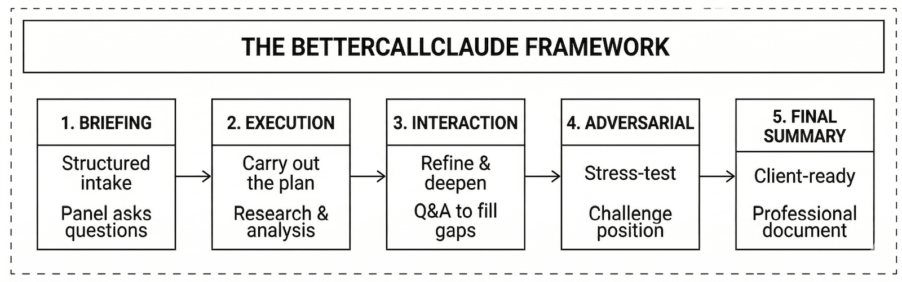

[](https://github.com/fedec65/bettercallclaude-espana/releases)
[](LICENSE)
[](https://claude.ai)
[](https://bettercallclaude.es)
[](https://mcp.bettercallclaude.es/health)

<p align="center">
  
</p>

<p align="center"><strong>Spain Legal Intelligence Plugin for Cowork Desktop</strong></p>

BetterCallClaude España transforms legal research, case strategy, and document drafting for Spanish lawyers. It provides deep integration with Spanish legal databases, bilingual analysis (ES/EN), and built-in *secreto profesional* protection — 20 agents, 21 commands, 15 skills, and 12 MCP servers covering TS/STS/AP/STC precedent research, litigation strategy, adversarial analysis, legal drafting, citation verification, document intelligence, and sports arbitration across all 17 Autonomous Communities.

> **Claude Code CLI users**: this repository is Cowork Desktop only. The CLI version is at [fedec65/bettercallclaude-cli](https://github.com/fedec65/bettercallclaude-cli).

---

## Overview

BetterCallClaude provides a structured methodology for handling legal work with AI assistance. The framework consists of five interconnected phases.



---

## What's New in v1.0.0

**v1.0.0 — Initial Spain release.** Complete adaptation of the Swiss BetterCallClaude plugin to the Spanish legal environment.

- **20 specialist agents** covering all major areas of Spanish law
- **21 commands** for research, strategy, drafting, citation, analysis, and workflow
- **15 skills** providing reusable legal expertise
- **7 MCP servers** connecting to Spanish legal databases (placeholder configs — actual URLs to be provided)
- **Plugin scope enforcement** — all legal work uses exclusively BetterCallClaude España agents, skills, and MCP servers

**Content counts**: 20 agents, 21 commands, 15 skills, 12 MCP servers in `.mcp.json` (11 remote HTTP + `ollama` local STDIO).

---

## Installation

1. In Cowork, click **Customize** > **Browse plugins** > **Personal** > **+** > **Add marketplace from GitHub**
2. Enter `fedec65/bettercallclaude-espana` and click **Sync**
3. Click **Install** on the BetterCallClaude España card

MCP servers connect automatically via HTTP. No Node.js, no local setup, no API keys required.

---

## Commands

| Command | Description |
|---------|-------------|
| `/bettercallclaude-espana:legal` | Intelligent gateway — analyzes intent, routes to specialist agent, manages workflows. Use `--refine` for vague queries. |
| `/bettercallclaude-espana:refine` | Transform vague queries into structured prompts via Socratic dialogue. |
| `/bettercallclaude-espana:research` | Search Spanish precedents and compile research memos. TS/STS/AP databases, doctrine. |
| `/bettercallclaude-espana:strategy` | Litigation strategy with risk assessment and cost-benefit under LEC. |
| `/bettercallclaude-espana:draft` | Draft Spanish documents: contracts, court submissions, opinions with citations. |
| `/bettercallclaude-espana:cite` | Verify and format Spanish citations (STS, SAP, STC, BOE). |
| `/bettercallclaude-espana:validate` | Validate Spanish citations in bulk — format, existence, consistency. |
| `/bettercallclaude-espana:precedent` | Search and analyze TS/STS/STC precedents with chain tracking. |
| `/bettercallclaude-espana:federal` | Analyze under Spanish state law (CC, CP, LEC, LOPJ, CE). |
| `/bettercallclaude-espana:autonomic` | Analyze under autonomic law for a specific CCAA. |
| `/bettercallclaude-espana:adversarial` | Three-agent adversarial: advocate, adversary, judicial analyst. |
| `/bettercallclaude-espana:briefing` | Pre-execution briefing with specialist panel and execution plan. |
| `/bettercallclaude-espana:workflow` | Multi-agent workflows: due diligence, litigation prep, contract lifecycle. |
| `/bettercallclaude-espana:translate` | ES ↔ EN legal translation preserving terminology precision. |
| `/bettercallclaude-espana:doc-analyze` | Analyze Spanish legal documents — issues, clauses, citations, compliance. |
| `/bettercallclaude-espana:summarize` | Consolidate pipeline output — deduplicate, control length. |
| `/bettercallclaude-espana:setup` | Check MCP connectivity for all 7 servers. |
| `/bettercallclaude-espana:version` | Display version, components, system status. |
| `/bettercallclaude-espana:legal-5step` | Execute 5-step framework: intake → research → strategy → adversarial → draft. |
| `/bettercallclaude-espana:privacy` | View/change privacy mode (`strict` / `balanced` / `cloud`). |
| `/bettercallclaude-espana:help` | Show command reference, agents, skills, examples. |

### Skills

| Skill | Description |
|-------|-------------|
| `legal-5step-framework` | Coordinates the 5-step pipeline, enforces data flow, manages quality gates. |

### Usage Examples

```
/bettercallclaude-espana:legal Necesito evaluar nuestra exposición bajo el Art. 1255 CC por incumplimiento contractual

/bettercallclaude-espana:refine Tengo problemas con mi arrendador

/bettercallclaude-espana:research Art. 1101 CC responsabilidad contractual por incumplimiento

/bettercallclaude-espana:strategy Disputa de arrendamiento comercial en Madrid, arrendador reclama EUR 200k

/bettercallclaude-espana:draft Contrato de trabajo para ingeniero de software en Barcelona, bilingüe ES/EN

/bettercallclaude-espana:adversarial ¿Es exigible la cláusula de no competencia en este contrato de trabajo?

/bettercallclaude-espana:workflow litigation-prep Reclamación por daños personales contra fabricante

/bettercallclaude-espana:briefing Preparar litigio completo por incumplimiento del Art. 1255 CC, EUR 500K, Madrid

/bettercallclaude-espana:autonomic MD Competencia del Juzgado de Primera Instancia para disputas contractuales

/bettercallclaude-espana:doc-analyze @contrato.pdf Revisar este contrato de arrendamiento comercial
```

---

## Key Features

- **Briefing sessions** — Complex queries trigger collaborative intake with specialist panels and structured plans.
- **Adversarial analysis** — Three-agent workflow: advocate, adversary, judicial analyst using Spanish legal methodology.
- **Multi-agent workflows** — Predefined pipelines for due diligence, litigation prep, contract lifecycle.
- **All 17 CCAA** — Full autonomic coverage with court systems, citation formats, and MCP search.
- **Bilingual** — Automatic ES/EN detection with correct legal terminology and citation formats.

---

## MCP Servers

All servers connect automatically. No configuration required.

| Server | Purpose | Transport |
|--------|---------|-----------|
| `cendoj-jurisprudencia` | Spanish court decision search (TS + autonomic) | HTTP |
| `cendoj-jurisprudencia` | Tribunal Supremo decision search | HTTP |
| `legal-citations-esp` | Citation verification and formatting | HTTP |
| `boe-legislacion` | State legislation database (SPARQL) | HTTP |
| `legal-persona-esp` | Spain-law document intelligence | HTTP |
| `tribunal-constitucional` | Tribunal Constitucional decisions | HTTP |
| `ollama` | Local privacy classification for secreto profesional | Local |

The 11 remote HTTP servers connect directly to `https://mcp.bettercallclaude.es`. No API keys required.

See [CONNECTORS.md](bettercallclaude-espana/CONNECTORS.md) for detailed API documentation.

---

## Privacy

BetterCallClaude España includes built-in *secreto profesional* detection (attorney-client privilege, Art. 24 LOPJ / Art. 542 CP). A `PreToolUse` hook scans outgoing tool calls for privilege indicators in Spanish and English.

| Mode | Behavior |
|------|----------|
| `strict` | Blocks (`deny`) strong markers. Non-privileged content passes through. Ollama exempt. |
| `balanced` | Strong markers prompt (`ask`). Weak markers with legal context also prompt. Default. |
| `cloud` | Strong markers prompt (`ask`). Weak markers allowed without prompt. |

> **Disclaimer**: Privacy routing is assistive and does not guarantee compliance with Art. 24 LOPJ or Art. 542 CP. Lawyers remain professionally responsible for protecting client confidentiality.

---

## Language Support

| Language | Code | Legal Context |
|----------|------|---------------|
| Spanish | ES | Primary: CC, CP, LEC, STS. Used throughout Spain. |
| English | EN | Working language with Spanish legal term mapping. |

---

## Requirements

- Claude Cowork Desktop (latest version)
- Node.js >= 18 (for the ollama privacy classifier only)

---

## CLI Version

Prefer working from the terminal? **[BetterCallClaude CLI](https://github.com/fedec65/bettercallclaude-cli)** is the Claude Code CLI edition.

---

## Author

Federico Cesconi — [fedec65/bettercallclaude-espana](https://github.com/fedec65/bettercallclaude-espana) — [bettercallclaude.es](https://bettercallclaude.es)

## License

AGPL-3.0 — See [LICENSE](LICENSE) for full terms.

[Support the project](https://buymeacoffee.com/federicocesconi)

---

## For Developers

This repo contains the plugin only. MCP server source code lives in a separate repository.

```bash
npm run package        # Create distributable plugin zip
```

See [CONNECTORS.md](bettercallclaude-espana/CONNECTORS.md) for MCP server API docs and [CONTRIBUTING.md](CONTRIBUTING.md) for contributor workflow.

---

## Professional Disclaimer

BetterCallClaude is a legal research and analysis tool. All outputs:

- Require professional lawyer review before use.
- Do not constitute legal advice.
- May contain errors or outdated information.
- Must be verified against official sources (BOE, court databases, official gazettes).
- Must be adapted to specific case circumstances.

Lawyers maintain full professional responsibility. This tool assists but does not replace professional judgment.
